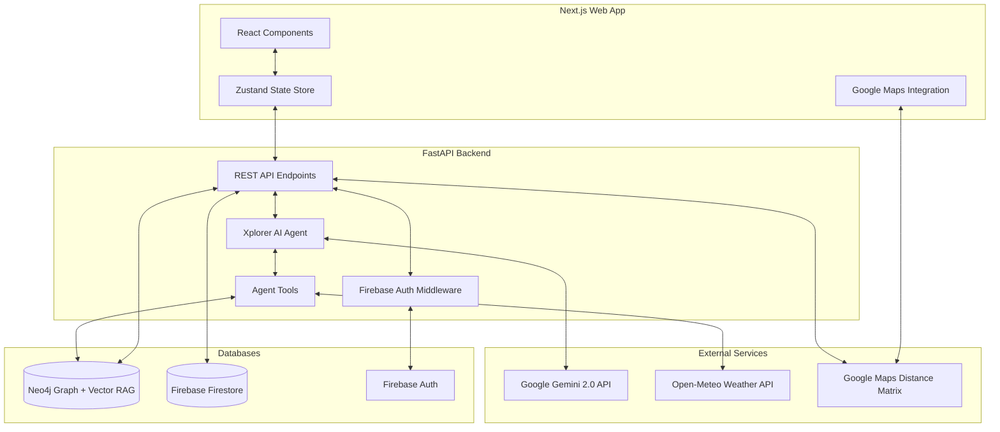
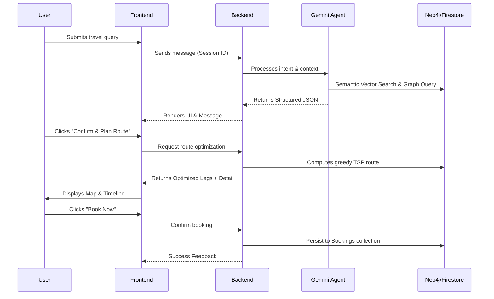

# Xplorer Backend

The backend service for **Xplorer**, an AI-powered smart travel agent for Chennai, India. This service handles user authentication, maintains a personalized conversation history, and uses a Knowledge Graph coupled with Google's Gemini LLM to generate highly contextual, multi-intent travel itineraries and booking suggestions.

## Tech Stack

*   **Framework:** FastAPI (Python)
*   **AI / LLM:** Google Gemini 2.0 Flash (via `google-genai` & `langchain-google-genai`)
*   **Agent Logic:** Autonomous Function Calling Agent
*   **Knowledge Graph Database:** Neo4j (Graph + Vector RAG)
*   **User Data & Conversations:** Firebase Auth & Firestore
*   **External APIs:** Google Maps API (Distance Matrix), Open-Meteo API (Weather Forecasts)

## System Architecture



## User Flow



## Project Structure

```text
backend/
├── main.py                  # FastAPI application entry point
├── config/                  # Firebase and external API configurations
├── middleware/              # Authentication middleware (Firebase ID tokens)
├── models/                  # Pydantic models (Auth, User, Chat, Booking)
├── routes/                  # API routers (Authentication, User/Chat operations)
├── services/
│   ├── auth_service.py      # Firebase Auth integration logic
│   ├── firestore_service.py # Firestore read/writes (Profiles, Chats, Bookings)
│   ├── neo4j_service.py     # Neo4j query execution (Places, Hotels, Transport)
│   ├── travel_ai_service.py # Core LangChain + Gemini Agent logic
│   ├── build_graph.py       # Script to populate Neo4j from JSON data files
│   └── data/                # JSON seed data (places, hotels, transport)
└── requirements.txt         # Python dependencies
```

## Prerequisites

*   Python 3.9+
*   Neo4j Desktop or Neo4j AuraDB instance running
*   Firebase Project with Authentication (Email/Password) and Firestore enabled
*   Google Gemini API Key
*   Google Maps API Key (Distance Matrix API enabled)


## Installation & Setup

1.  **Create and activate a virtual environment:**
    ```bash
    python -m venv venv
    source venv/bin/activate
    ```

2.  **Install dependencies:**
    ```bash
    pip install -r requirements.txt
    ```

3.  **Build the Knowledge Graph:**
    The AI relies on Neo4j for real travel data. Run the ingestion script to populate the graph from the `services/data/` JSON files and calculate spatial connections:
    ```bash
    python services/build_graph.py
    ```

## Running the Server

Start the FastAPI development server:

```bash
uvicorn main:app --reload --port 8000
```

The API documentation (Swagger UI) will be available at: [http://localhost:8000/docs](http://localhost:8000/docs)

## Key Features & Capabilities

*   **Hybrid RAG (Graph + Vector):** Combines semantic vector search (via `SentenceTransformers`) for vague descriptive queries with structured Knowledge Graph traversal for complex relationships and constraints.
*   **Generative UI Support:** The AI doesn't just output text; it returns a structured JSON schema including `ui_elements`. This allows the frontend to dynamically render interactive components (Date Pickers, Select Dropdowns) when the AI needs missing information.
*   **Multi-Intent Handling:** The LangChain agent understands if a user wants a full itinerary, just a hotel, or just a cab, and queries the Neo4j graph using dedicated tools (`find_places`, `find_hotels`, `find_cabs`).
*   **Real-time Weather Checks:** The AI automatically fetches the weather for the requested travel dates via the Open-Meteo API and evaluates it before confirming an itinerary, warning the user of extreme conditions.
*   **Persistent Context:** All user form submissions (`submitted_data`) and conversations are saved to Firestore, allowing users to resume their planning seamlessly.
